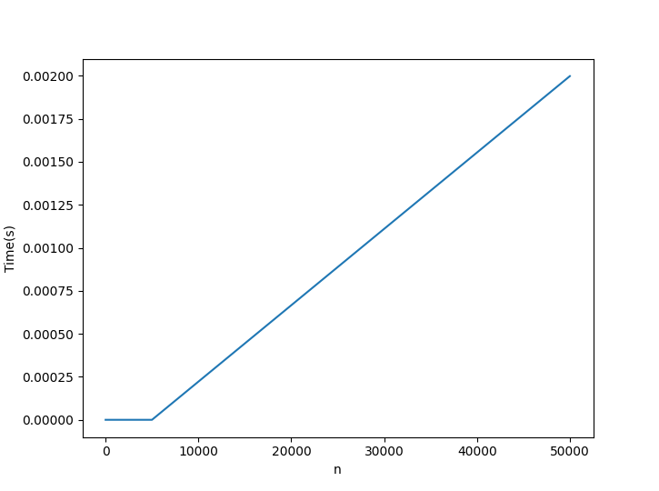
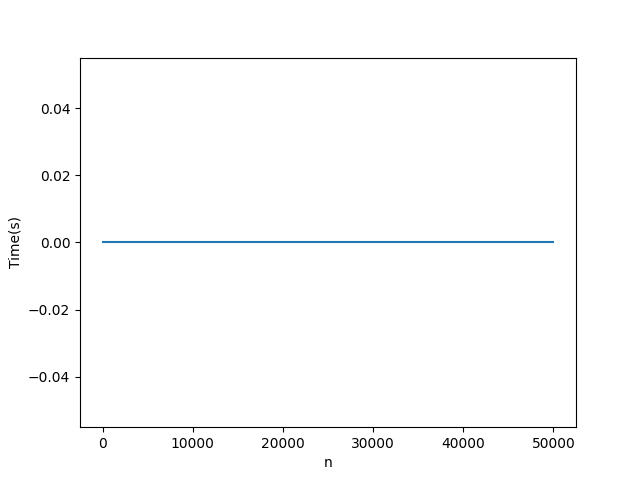

# Week 2

## **I. Bitwise operator**

Trong C, C++ chúng ta có 6 toán tử để xử lí bit:

- **& (bitwise AND)**: Trả về 1 nếu cả 2 bit đều là 1.
- **| (bitwise OR)**: Trả về 1 nếu một trong hai bit là 1.
- **^ (bitwise XOR)**: Trả về 1 nếu 2 bit là khác nhau.
- **<< (left shift)**: Dịch trái 1 bit.
- **>> (right shift)**: Dịch phải 1 bit.
- **~ (bitwise NOT)**: Đảo bit (0 thành 1, 1 thành 0)

### **Bảng chân trị:**

|  a  |  b  | a & b | a \| b | a ^ b | ~a  |
| :-: | :-: | :---: | :----: | :---: | :-: |
|  0  |  0  |   0   |   0    |   0   |  1  |
|  0  |  1  |   0   |   1    |   1   |  1  |
|  1  |  0  |   0   |   1    |   1   |  0  |
|  1  |  1  |   1   |   1    |   0   |  0  |

### **Example**

```c++
int a = 5; //0101
int b = 11; //1011

cout << "a & b = " << (a & b) << '\n'; //0001
cout << "a | b = " << (a | b) << '\n'; //1111
cout << "a ^ b = " << (a ^ b) << '\n';  //1110
cout << "~a = " << (~a) << '\n';    //  ...111010

```

Output:

```
a & b = 1
a | b = 15
a ^ b = 14
~a = -6
```

### Application

- Tốc độ xử lí phép toán nhanh hơn những toán tử thông thường
- Có thể sử dụng để giải quyết 1 số bài toán đặc thù (VD: Nim game, đếm tuần xuất lẻ, quy hoạch động trạng thái, ...)

### Bitwise tricks

Một số trick có thể sử dụng áp dụng toán tử bit (chỉ áp dụng với số nguyên không âm):

#### 1. Tính nhanh $2^n $

```c++
1 << n
```

#### 2. Chia cho n cho 2

```c++
n >>= 1
```

#### 3. Gấp đôi n

```c++
n <<= 1
```

#### 4. Kiểm tra xem n có phải số lẻ không

```c++
if(n & 1){
    ...
}
```

#### 5. Lấy bit thấp nhất của 1 số (bit 1 nằm bên phải cùng)

```c++
n & -n
```

#### 6. Swap hai số

```c++
a ^= b
b ^= a
a ^= b
```

Có thể viết ngắn gọn bằng 1 dòng:

```c++
a ^= b ^= a ^= b
```

#### 7. Lấy ra số lớn hơn và nhỏ hơn giữa 2 số nguyên (mang ra treu tre con)

```c++
b & ((a-b) >> 31) | a & (~(a-b) >> 31); // get the bigger
a & ((a-b) >> 31) | b & (~(a-b) >> 31); // get the smaller
```

#### 8. Kiểm tra xem số nguyên có dạng 2 ^ n không

```c++
a > 0 && (a & (a - 1)) == 0;
```

#### 9. Tăng, giảm đi 1 đơn vị

```c++
-~respect; //respect++
~-a; //a--
```

## **II. References**

Tham chiếu là một biến "tham chiếu" đến một biến khác. Ta sử dụng toán tử & để khai báo tham chiếu

```c++
string s = "Anh yeu em yeu ca con cho nha em"
string &ref = s;
```

Bây giờ ta có thể thay đổi giá trị của s thông qua s hoặc ref:

```c++
ref = "I love you, so do your dog";
cout << s; // I love you, so do your dog
```

### Lưu ý:

Toán tử & ở trên được sử dụng để tạo tham chiếu. Nó cũng có thể sử dụng để lấy địa chỉ của một biến.

```c++
string s = "Anh yeu em yeu ca con cho nha em"
cout << &s; // 0x1041fde0
```

**Tham chiếu** và **con trỏ** trong C++ có thể truy xuất được ở mức độ địa chỉ của ô nhớ các biến. Đây là lí do tốc độ thực thi của C++ nhanh hơn so với những ngôn ngữ khác.

### Application

- #### Truyền "bản thân biến đó" vào hàm để thay đổi giá trị các biến
  Ex: Tạo hàm để swap hay số

```c++
void swap(int &a, int &b){
    int tmp = a;
    a = b;
    b = tmp;
}
```

- #### Truyền "bản thân biến đó" vào hàm để để tiết kiệm bộ nhớ (tránh việc hàm tạo bản sao của biến)

  Ex:

```c++
void foo(vector<int> &a, vector<int> &b){...}
```

## **III. Big O Notation**

</img>

## Độ phức tạp thuật toán là gì

Thời gian thực thi của một thuật toán phụ thuộc vào nhiều yếu tố:

- Ngôn ngữ được sử dụng (C, C++, Python, Java, C#, PHP, ...)
- Phụ thuộc vào phần cứng của máy (Ram, CPU, ...)
- Thời gian chạy chương trình ở mỗi thời điểm đôi khi khác nhau

-> Chúng ta sẽ chỉ quan tâm đến _mức độ tăng_ của thời gian thực thi chương trình

_Ví dụ: Tính tổng các số nguyên từ 1 đến n_

**Code:**

```c++
int sum(int n){
    int res = 0;
    for(int i = 1; i <= n; ++i){
        res += i;
    }
    return res;
}
```

</img>\

**Time comlexity: Linear**

**Code:**

```c++
int sum(int n){
    return n * (n - 1) >> 1;
}
```

</img>

**Time complexity: Constant**

Chúng ta có thể sử dụng một thuật ngữ để biểu thị độ phức tạp của thuật toán đó là **Big O Notation**

- O(1): Constant time
  - Truy xuất phần tử ngẫu nhiên trong mảng
  - Cộng, trừ, nhân chia hai số
- O(log n): Lograrithmic time

  - Chặt nhị phân
  - Truy vấn trên cây

- O(n log n): quasilinear time
  - quick sort
  - heap sort
  - merge sort
- O(n^2): Quadratic time
  - insertion sort
  - bubble sort
  - selection sort
- O(n!): Factorial time
  - Bài toán người đi du lịch

## Cách để tính độ phức tạp thuật toán

\* Chỉ cần quan tâm đến phần code có độ phức tạp lớn nhất

**Example:**

```c++
for(int i = 0; i < n; ++i){ //
    .... //O(1)             //  => O(n)
}                           //

for(int i = 0; i < n; ++i){         //
    for(int j = 0; j < n; ++j){     //
        ...  //O(1)                 //  => O(n^2)
    }                               //
}                                   //
```

Time complexity: O(n^2)

Ex1: Tính độ phức tạp của chương trình sau:

```c++
int foo(int n, int a[]){
    for(int i = 0; i < n - 1; ++i){
        for(int j = i + 1; j < n; ++j){
            if(a[i] < a[j]){
                int tmp = a[i];
                a[i] = a[j];
                a[j] = tmp;
            }
        }
    }
}

```

Ex2: Tính độ phức tạp của chương trình sau:

```c++
int foo(){
    int sum = 0;
    for(int i = 0; i < 100; ++i){
        sum += i;
    }
    for(int i = 0; i < 123456; ++i){
        sum += i;
    }
    return sum;
}
```

Ex3: Tính độ phức tạp của chương trình sau:

```c++
bool foo(int n, int k, int a[]){
    int l = 0, r = n - 1;
    while (l < r) {
        int m = l + r >> 1;
        if (a[m] < k) {
            l = m + 1;
        }
        else {
            r = m;
        }
    }
    return a[l] == k ? true : false;
}
```
